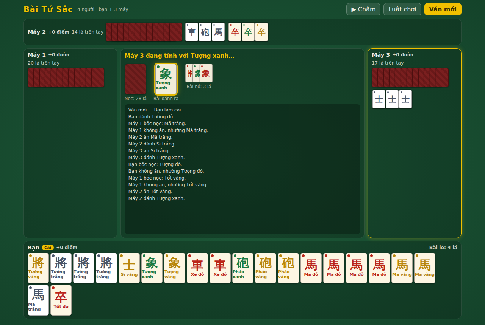
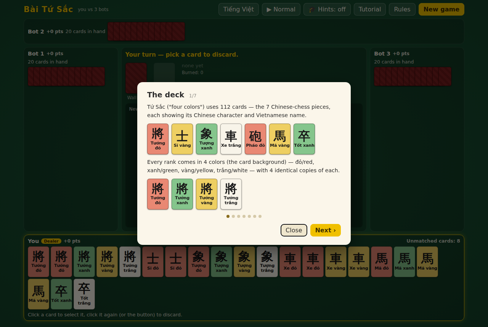

# Bài Tứ Sắc

A browser-playable implementation of **Tứ Sắc** (Four-Color Cards), the Vietnamese
melding card game — you against three AI opponents, with a fully portable rules
engine designed to be reused on iOS and Android.

The UI defaults to **English** (toggle to Tiếng Việt in the header); cards always
show their Chinese character and Vietnamese name, with the suit as the card's
background color. A built-in **tutorial** teaches the rules and can start a
practice game with per-turn hints from a coach.



## Play it

Deployed via GitHub Pages (see below):
**https://cquach88.github.io/ubiquitous-palm-tree/**

Or run locally:

```bash
npm install
npm run dev        # local dev server with hot reload
```

or build a static bundle you can host anywhere (GitHub Pages, Netlify, S3…):

```bash
npm run build      # outputs dist/ — plain static files, relative paths
npm run preview    # serve the production build locally
```

The UI works with mouse or touch and is responsive down to phone-sized screens.
Session scores, language, name, speed, sort, and hint preferences persist in
`localStorage`.

- **Hand sorting** — drag cards to arrange your hand yourself, or use the
  sort chip to cycle auto-sort modes: by rank, by color, or by melds (groups
  complete/partial sets together with a gap before the leftovers). Dragging
  switches to manual mode automatically.
- **Game speed** — cycle 🐢 Slow / ▶ Normal / ⏩ Fast to control how quickly the
  bots act, so you can follow every capture and discard.
- **Your name** — click the ✎ next to your seat to set a display name; it's
  used at the table, in the log, and online.

## Online multiplayer

Click **Play online** → *Host a game* to get a 6-letter game code; friends
choose *Join a game* and enter the same code. Up to 4 players — empty seats
are played by bots, and a player who drops mid-game is taken over by a bot.
Only the host can start rounds.

The room is a **session**: the point tally resets whenever you host or join a
new room, and tracks **player identities** rather than seats — someone who
leaves (or is kicked) and rejoins from the same browser tab gets their points
back, while a bot filling their seat scores separately. The host can **kick**
any player from the lobby dialog and **reset the tally** at any time (there's
also a reset button for the solo tally). A **chat panel** below the game log
lets everyone at the table talk during play.

How it works: connections are peer-to-peer WebRTC data channels (PeerJS, using
its free public signaling cloud), so no game server is needed and it works
from the static GitHub Pages deployment. The host is authoritative — it runs
the engine from `src/core` and broadcasts each guest a **redacted** view
(your own hand is real; other hands and the wall are dummies), so clients
cannot peek. Guests send actions; the host validates them against the engine
before applying. For local development, `?peer=localhost:9099` in the URL
points the client at a local PeerServer (`node_modules/.bin/peerjs --port 9099`).

## Tutorial mode

The **Tutorial** button (auto-opened on first visit) walks through the deck, the
valid groups, the turn flow, and scoring with rendered example cards — in either
language. Its last step starts a **practice game with hints on**: every turn the
coach highlights a suggested move (discard, capture, or pass) and explains it in
one line. Hints can be toggled any time with the 🎓 button.



## The game

The deck has **112 cards**: 7 ranks (Tướng 將, Sĩ 士, Tượng 相, Xe 車, Pháo 炮,
Ngựa 馬, Tốt 卒) × 4 colors (đỏ/red, xanh/green, vàng/yellow, trắng/white) × 4
copies. The dealer gets 21 cards, everyone else 20. The goal is to arrange your
entire hand into valid groups ("bộ"):

| Group | Cards |
| --- | --- |
| Đôi / ba / quằn | 2 / 3 / 4 identical cards (same rank **and** color) |
| Tướng-Sĩ-Tượng | one of each, same color |
| Xe-Pháo-Ngựa | one of each, same color |
| Tốt khác màu | 3 or 4 pawns, all different colors |
| Tướng lẻ | a lone General stands on its own |

Each turn a card is on offer (the previous discard, or a card flipped from the
wall). You may **capture it ("ăn")** into a face-up meld of 3+ cards and then
discard, or pass. A card you flip from the wall yourself may additionally be
captured into a **pair** with an identical hand card ("chui đôi") — discards
can never be taken just to pair them. The first player whose full hand is completed by an offered
card **wins ("tới")** — the engine detects this automatically for every seat.
If the wall runs out, the round is a draw.

Scoring uses a common **lệnh** table (pair 0 · run / 3 pawns / lone general 1 ·
4 pawns 4 · concealed triple "khạp" 6 / exposed 1 · quad "quằn" 8 concealed /
6 exposed · +7 for winning). Only the winner scores: their lệnh total is added
to a running tally kept across rounds, and the other players' totals are
unchanged — melds earn nothing unless you win the round.

### Simplifications vs. traditional table rules

To keep play flowing in a single-device, turn-based UI, a few traditional
priority rules are simplified (all rule logic lives in `src/core`, so tightening
these is localized work):

- Forced captures (phải ăn đôi/khạp) are not enforced — capturing is always the
  player's choice, except that winning claims resolve automatically.
- A flipped wall card that the flipper declines is offered to the next player
  only, rather than being contested by all seats (winning claims *are* checked
  for all four seats on every offered card).
- Khạp/quằn declarations are implicit: concealed sets simply score their full
  value at the end.

## Architecture — built to be ported

```
src/
├── core/          ← pure TypeScript, ZERO platform dependencies
│   ├── types.ts   cards, colors, ranks, deck, display metadata
│   ├── rng.ts     seeded PRNG (games are reproducible from a seed)
│   ├── melds.ts   meld validity, hand decomposition, capture options
│   ├── scoring.ts lệnh scoring + best-scoring decomposition
│   ├── engine.ts  the game state machine (pure reducer)
│   ├── ai.ts      heuristic AI (leftover-count minimization)
│   └── index.ts   public API surface
└── web/           ← thin browser layer (DOM + CSS only)
    ├── main.ts    renders GameState, dispatches Actions, paces the AI
    ├── cards.ts   card face rendering
    ├── i18n.ts    UI strings (English default, Vietnamese toggle)
    ├── tutorial.ts illustrated rule walkthrough
    ├── net.ts     online play: PeerJS transport + state redaction
    └── style.css
```

The core is a **pure reducer**: `newGame({seed})` produces a `GameState`, and
`applyAction(state, action)` returns the next state without mutating the input.
There are no timers, no randomness outside the seeded deal, no DOM, no Node
APIs — `src/core` compiles anywhere TypeScript runs. The engine's game log is a
list of structured events (not strings), so each UI localizes them however it
likes. The entire contract between UI and rules is:

```ts
let state = newGame({ seed });
render(state);                          // draw whatever you like
state = applyAction(state, action);     // discard / eat / pass
const options = legalEats(state);       // what the responder may capture
const bot = aiChooseAction(state);      // let the AI move
```

The web layer (`src/web`) is ~400 lines that render state to HTML and translate
clicks into actions. That's the only part you replace per platform.

## Porting to iOS / Android

Two natural paths, in increasing order of effort:

1. **Capacitor (fastest)** — the production build is a self-contained static
   bundle with relative paths and touch-friendly, responsive UI, so it wraps
   directly:

   ```bash
   npm i -D @capacitor/core @capacitor/cli @capacitor/ios @capacitor/android
   npx cap init "Tu Sac" com.example.tusac --web-dir dist
   npm run build && npx cap add ios && npx cap add android && npx cap sync
   ```

2. **React Native / native UI** — publish `src/core` as a package (it has no
   dependencies; point `package.json` `exports` at it or copy the folder) and
   write native screens that render `GameState` and dispatch `Action`s. Game
   logic, AI, and scoring come along unchanged, and the vitest suite keeps
   guarding them. The same core would also drop into a server for online
   multiplayer, since games are deterministic given a seed and action list.

## Deployment (GitHub Pages)

`.github/workflows/deploy.yml` builds, tests, and publishes `dist/` to GitHub
Pages on every push to `main` (and to the development branch), or on demand via
*Actions → Deploy to GitHub Pages → Run workflow*. The site URL is
`https://<owner>.github.io/ubiquitous-palm-tree/`.

Notes:

- If the first run fails at the *configure-pages* step, enable Pages once by
  hand: **Settings → Pages → Source: GitHub Actions**, then re-run.
- GitHub Pages on a **private** repository requires a paid GitHub plan; on a
  free plan, make the repository public to publish.

## Error reporting & replay debugging

The app records every uncaught error — and every action the engine rejects —
to a local ring buffer, together with the context needed to reproduce the
game: the deal **seed**, the **dealer**, and the full **action history** in a
compact encoding (`src/core/replay.ts`). When something breaks, a toast
offers **Report a problem** (also available from the Rules dialog), which
opens a prefilled GitHub issue whose body contains the report as a fenced
```json``` block. Reports contain no personal data and the player reviews
the issue before submitting.

Because the engine is a pure, seeded reducer, a report replays
deterministically. To reproduce a reported bug:

1. Open the issue, copy the JSON block to a file (say `report.json`).
2. Run:

   ```bash
   REPLAY_REPORT=report.json npm test -- replay
   ```

   The replay test rebuilds the game from `seed`/`dealer`, applies `actions`,
   and prints where the engine failed (`applied`, `failedAction`, `error`,
   `finalPhase`) plus the error messages the player saw.

Report schema (all on one object): `app`, `version`, `time`, `url`,
`userAgent`, `mode` (solo/host/guest), `locale`, `seed`, `dealer`, `actions`
(encoded history; empty for guests, who don't hold authoritative state),
`historyComplete` (false if the tab restored mid-game), `phase`, and
`errors[]` (`time`, `kind`, `message`, `stack`, `action`, `phase`).

Maintainer loop (works for humans and for Claude Code): list open issues
titled `[bug report]`, extract the JSON block, replay it, fix, and add the
report as a regression test using `replay()` from `src/core/replay.ts`.

## Development

```bash
npm test           # 28 unit + property tests, incl. 200 full simulated games
npm run typecheck  # strict TS, no emit
```

The simulation test (`src/core/sim.test.ts`) plays 200 seeded AI-vs-AI games to
completion, asserting card-conservation and hand-size invariants at every step
and validating every winning hand — a good safety net when experimenting with
rule changes.
